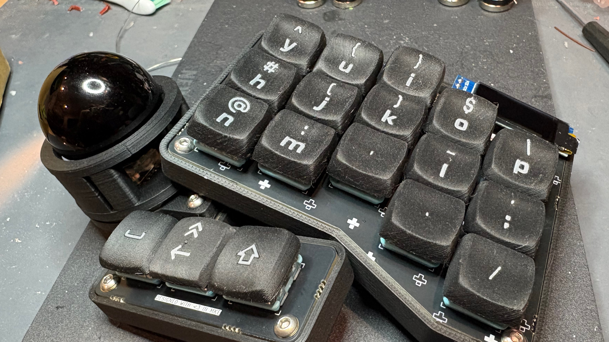
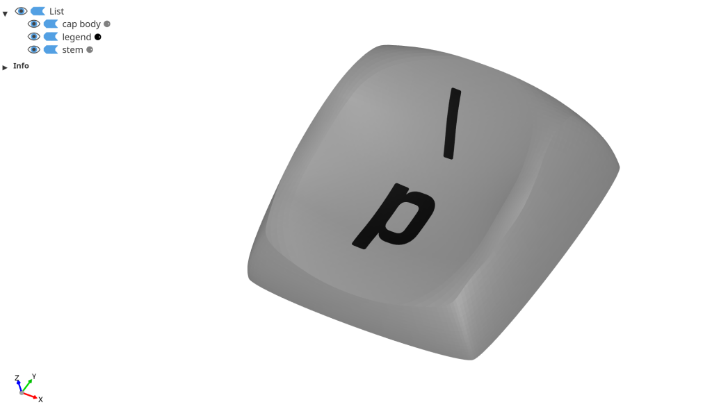
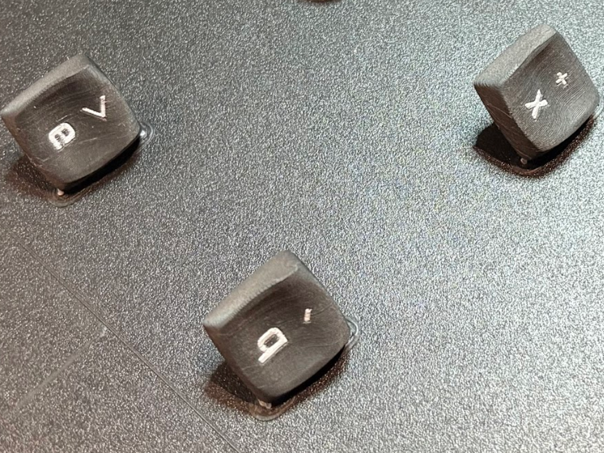

# Keycap Legends

Generate 3D-printable keycaps with text legends and Kailh Choc stems.



> **Note:** This project has been vibe coded with [Claude](https://claude.ai) (Anthropic's AI assistant). The code
> works, but don't expect enterprise-grade polish.
>
> The included configuration is for a **3x5 split keyboard layout** with symbols based on the author's
> [ZMK keymap](https://github.com/coredump/zmk-config/). You'll likely want to customize `config.toml` for your own
> layout and preferences.
>
> The Subliminal Contradiction STEP files use **Cherry MX keycap dimensions** (not Choc v1 size) with **Kailh Choc stems
** - larger keycap profile on low-profile switches.

## Table of Contents

- [What It Does](#what-it-does)
- [Acknowledgements](#acknowledgements)
- [Requirements](#requirements)
- [Setup](#setup)
- [Usage](#usage)
- [uv Commands Reference](#uv-commands-reference)
- [Configuration](#configuration)
- [Preparing STEP Files with FreeCAD](#preparing-step-files-with-freecad)
- [Using Your Own STEP Files](#using-your-own-step-files)
- [Tips](#tips)
- [Printing Tips](#printing-tips)
- [License](#license)

## What It Does

Takes STEP files of keycap shells (from FreeCAD) and adds:

- **Text legends** - Characters carved into the keycap top surface (supports primary, secondary, and tertiary legends)
- **Kailh Choc stems** - Low-profile switch mount geometry

Outputs 3MF files with separate bodies (cap body, legend, stem) that slicers recognize as distinct objects, making
multi-material or multi-color printing easy - just assign different filaments to each body in your slicer.



## Acknowledgements

This project uses keycap shells from the **Subliminal Contradiction** sculpted keycap set
by [pseudoku](https://github.com/pseudoku).

- **GitHub:** [pseudoku/Subliminal-Contradiction](https://github.com/pseudoku/Subliminal-Contradiction)
- **Store:** If you want professionally cast versions of SC profile keycaps, check
  out [Asymplex](https://www.asymplex.xyz/product/made-to-order-sc-profile)

> ⚠️ **License Note:** The STEP files in `assets/` are licensed under **CC BY-NC 4.0** (NonCommercial). You may NOT use
> the keycap designs or generated 3MF files for commercial purposes. See [LICENSE](LICENSE) for details.

## Requirements

- Python 3.12+
- [mise](https://mise.jdx.dev/) (optional, for tool management)

## Setup

### Using mise (recommended)

```bash
# Install mise if you don't have it
curl https://mise.run | sh

# Install project tools (uv, watchexec)
mise install

# Create virtual environment and install dependencies
uv sync
```

### Manual setup

```bash
# Install uv
curl -LsSf https://astral.sh/uv/install.sh | sh

# Create virtual environment and install dependencies
uv sync
```

## Usage

### Generate keycaps

```bash
uv run main.py
```

Output files are saved to `results/` as 3MF files.

### List available fonts

```bash
uv run fonts.py
```

This lists all fonts available to build123d for legend text. Useful for finding Nerd Fonts or other installed fonts.

### Watch for changes (development)

```bash
watchexec -e py -- uv run main.py
```

### Visual debugging

The `ocp_vscode` library (included as a dependency) has a standalone viewer mode. To visualize all generated shapes for
debugging, replace `show` with `show_all` in `main.py`:

```python
from ocp_vscode import show_all

# ... at the end of the script:
show_all()
```

This opens a 3D viewer window showing all parts, useful for verifying legend placement and geometry.

### Process only specific rows

To debug specific rows without processing everything, edit `ONLY_ROWS` in `main.py`:

```python
ONLY_ROWS = None  # Process all rows
ONLY_ROWS = ["row_2"]  # Process only row_2
ONLY_ROWS = ["thumb_mid", "thumb_corners"]  # Process only thumb keys
```

## Mise Commands Reference

```bash
mise run run      # Generate keycaps (equivalent to `uv run main.py`)
mise run run_ocp  # Launch OCP-VSCode standalone viewer
```

## uv Commands Reference

```bash
uv sync              # Install/update dependencies from pyproject.toml
uv add <package>     # Add a new dependency
uv remove <package>  # Remove a dependency
uv run <script>      # Run a Python script in the virtual environment
uv lock              # Update the lock file
```

## Configuration

Edit `config.toml` to configure legends and settings. No Python knowledge required!

### Settings

```toml
[settings]
font = "Rajdhani"           # Default font for legends
primary_font_size = 8       # Main character size (mm)
secondary_font_size = 6     # Symbol size (mm)
tertiary_font_size = 5      # Third character size (mm)
legend_gap = 0.0            # Gap between primary and secondary
vertical_shift = 0.0        # Shift legend block up/down
tertiary_x_offset = -5.0    # Tertiary position (negative = left)
```

### STEP Files

```toml
[step_files.row_2]
path = "assets/1u_row_2.step"
rotation = 0    # Optional, degrees
has_stem = true # Optional, skip stem generation if STEP already has stem
```

### Legend Entries

```toml
[[legends.row_2]]
primary = "q"
secondary = "`"
mirror_x = false            # Optional, for reachy keys
primary_font = "Rajdhani"   # Optional override
secondary_font = "FantasqueSansM Nerd Font Propo"  # Optional override
tertiary = "1"              # Optional third character
tertiary_font = "Rajdhani"  # Optional override
```

## Preparing STEP Files with FreeCAD

> The STEP files in this project were prepared using FreeCAD 1.0 / 1.2 dev version.

If you have a mesh (STL/OBJ) of a keycap and need to convert it to STEP:

1. **Import mesh** - Use the Mesh workbench to import your file
2. **Repair mesh** - Use mesh repair tools to fix holes and ensure validity
3. **Decimate** - Lower the triangle count to reduce complexity
4. **Convert to shape** - In Part workbench, use "Part > Create shape from mesh"
5. **Convert to solid** - Use "Part > Convert to solid"
6. **Simplify** - Use "Edit > Copy > Simplify" to reduce geometry complexity
7. **Validate** - Use Part workbench check tools to ensure boolean operations will work
8. **Clean up** - Use Part and Draft workbenches to cut or clean the solid as needed
9. **Export** - Export as STEP file

## Using Your Own STEP Files

This project is designed to work with the STEP files in `assets/`, which are sculpted keycap shells from the "Subliminal
Contradiction" keycap set.

**It should be generic enough to work with other keycap STEP files**, but:

1. The STEP file should be a solid keycap body (with or without stem)
2. The largest bottom face is used for **stem plane** positioning
3. Legend placement is automatic - it finds the lowest point on the top surface near the center (works for concave, convex, and flat keycaps)
4. If your STEP file already includes a stem, set `has_stem = true` to skip stem generation
5. You may need to adjust rotation in config
6. Font sizes and positioning may need tuning

**The author can't provide much support for custom STEP files** - you're on your own for debugging CAD geometry issues.
Good luck!

## Tips

### Font Selection

Some fonts work better than others for keycap legends. Fonts with clean, simple geometry produce better results.
Recommended fonts to try:

- **DIN 1451** - Clean industrial look
- **Open Cherry** - Designed for keycaps

Use `uv run fonts.py` to list all available fonts on your system.

### Troubleshooting Broken Symbols

Sometimes certain symbols will break the 3MF output or cause meshing errors. If this happens:

1. **Try a different font size** - Slightly larger or smaller sizes can fix geometry issues
2. **Use a Nerd Font symbol** - Replace problematic characters with Nerd Font icons (e.g., `\uf069` instead of `*`)
3. **Simplify the glyph** - Some ornate characters have geometry that doesn't mesh well

## Printing Tips



- **Material:** PLA works well
- **Orientation:** 45° angle on the side recommended
- **Spacing:** getting some space around each key gives the print more travel time and can help with pieces detaching
  from the bed
- **Supports:** Required
- **Post-processing:** Stems may need light filing for fit (they print tight)
- **Blank keycaps:** If you want keycaps without visible legends, simply assign the same filament/color to both the cap
  body and legend in your slicer

## License

**Dual-licensed:**

- **Code** (Python, config, docs): [MIT License](LICENSE)
- **STEP files** in `assets/`: [CC BY-NC 4.0](https://creativecommons.org/licenses/by-nc/4.0/) (NonCommercial)

See [LICENSE](LICENSE) for full details.
