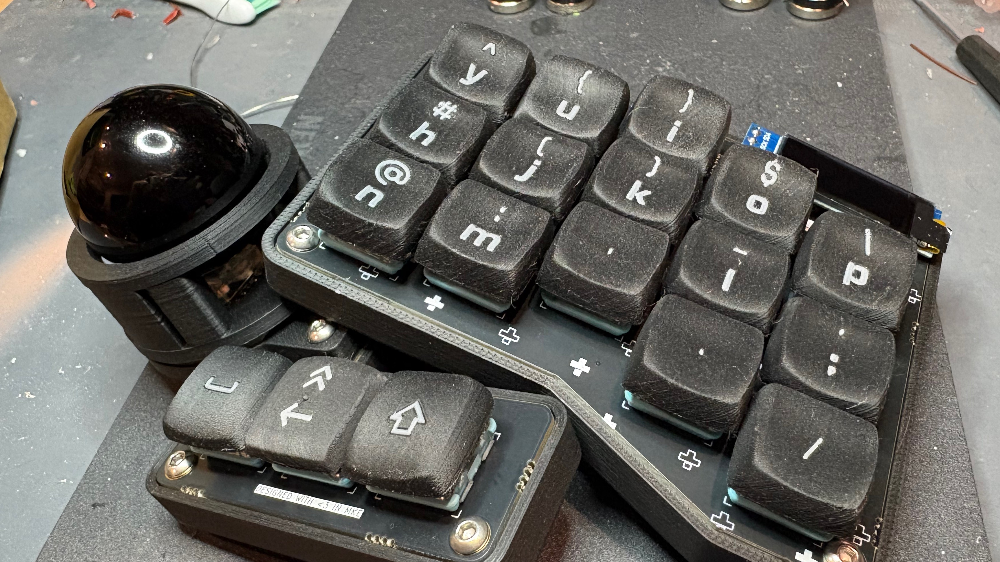
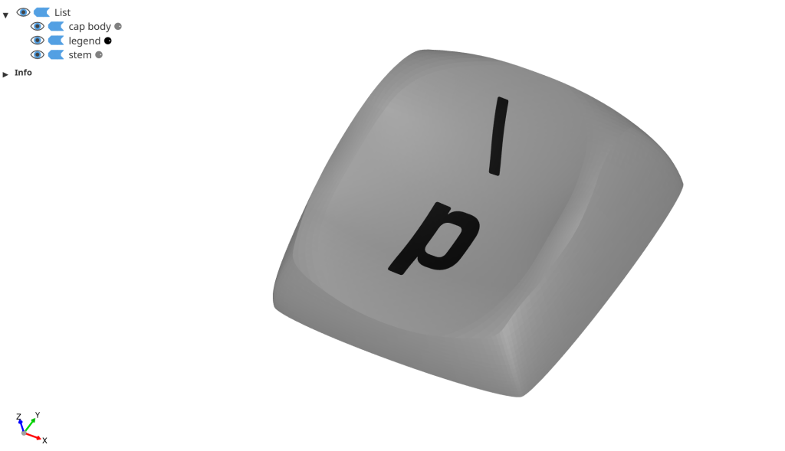
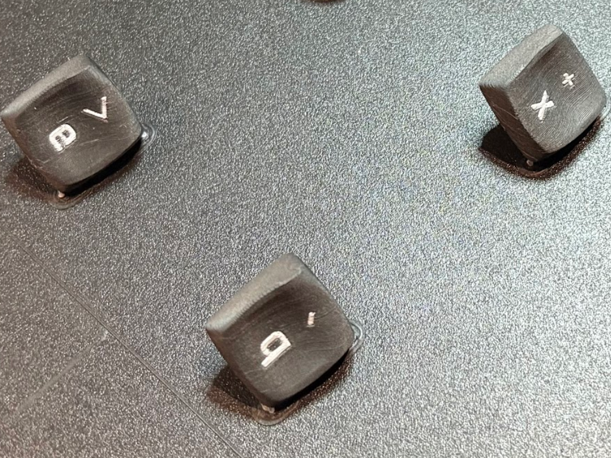

# Keycap Legends

Generate 3D-printable keycaps with text legends and Kailh Choc stems.



## Personal software

This is personal software. It was built for one person's use, with help from
an AI coding agent, and put online because someone else might find it useful.

It's not a product. There is no support, no roadmap, no promise it keeps
working. The level of security is appropriate for how the author uses it. You
don't need to worry about that on their behalf. The license is the contract.
Everything else here is context.

If that framing is interesting or annoying, the long version is here:
[On Personal Software](https://github.com/coredump/personal-software)

If this doesn't suit your needs, don't use it. No hard feelings.

> **Note:** The included configuration is for a **3x5 split keyboard layout** with symbols based on the author's
> [ZMK keymap](https://github.com/coredump/zmk-config/). You'll likely want to customize `config.toml` for your own
> layout and preferences.
>
> The Subliminal Contradiction STEP files use **Cherry MX keycap dimensions** (not Choc v1 size) with **Kailh Choc stems
** - larger keycap profile on low-profile switches.

## Table of Contents

- [Personal software](#personal-software)
- [What It Does](#what-it-does)
- [Acknowledgements](#acknowledgements)
- [Requirements](#requirements)
- [Setup](#setup)
- [Usage](#usage)
- [uv Commands Reference](#uv-commands-reference)
- [Configuration](#configuration)
- [Legend Layout](#legend-layout)
- [Symbol Set Examples](#symbol-set-examples)
- [Preparing STEP Files with FreeCAD](#preparing-step-files-with-freecad)
- [Using Your Own STEP Files](#using-your-own-step-files)
- [Tips](#tips)
- [Printing Tips](#printing-tips)
- [License](#license)

## What It Does

Takes STEP files of keycap shells (from FreeCAD) and adds:

- **Text legends** - Characters carved into the keycap top surface (supports primary, secondary, and tertiary legends)
- **Kailh Choc stems** - Low-profile switch mount geometry

Outputs 3MF files with separate bodies (cap body, legend, stem) that slicers recognize as distinct objects, making
multi-material or multi-color printing easy - just assign different filaments to each body in your slicer.



## Acknowledgements

This project uses keycap shells from the **Subliminal Contradiction** sculpted keycap set
by [pseudoku](https://github.com/pseudoku).

- **GitHub:** [pseudoku/Subliminal-Contradiction](https://github.com/pseudoku/Subliminal-Contradiction)
- **Store:** If you want professionally cast versions of SC profile keycaps, check
  out [Asymplex](https://www.asymplex.xyz/product/made-to-order-sc-profile)

> ⚠️ **License Note:** The STEP files in `assets/` are licensed under **CC BY-NC 4.0** (NonCommercial). You may NOT use
> the keycap designs or generated 3MF files for commercial purposes. See [LICENSE](LICENSE) for details.

## Requirements

- Python 3.12+
- [mise](https://mise.jdx.dev/) (optional, for tool management)

## Setup

### Using mise (recommended)

```bash
# Install mise if you don't have it
curl https://mise.run | sh

# Install project tools (uv, watchexec)
mise install

# Create virtual environment and install dependencies
uv sync
```

### Manual setup

```bash
# Install uv
curl -LsSf https://astral.sh/uv/install.sh | sh

# Create virtual environment and install dependencies
uv sync
```

## Usage

### Generate keycaps

```bash
uv run main.py
```

Output files are saved to `results/` as 3MF files.

### List available fonts

```bash
uv run fonts.py
```

This lists all fonts available to build123d for legend text. Useful for finding Nerd Fonts or other installed fonts.

### Watch for changes (development)

```bash
watchexec -e py -- uv run main.py
```

### Visual debugging

The `ocp_vscode` library (included as a dependency) has a standalone viewer mode. To visualize all generated shapes for
debugging, replace `show` with `show_all` in `main.py`:

```python
from ocp_vscode import show_all

# ... at the end of the script:
show_all()
```

This opens a 3D viewer window showing all parts, useful for verifying legend placement and geometry.

### Process only specific rows

To debug specific rows without processing everything, edit `ONLY_ROWS` in `main.py`:

```python
ONLY_ROWS = None  # Process all rows
ONLY_ROWS = ["row_2"]  # Process only row_2
ONLY_ROWS = ["thumb_mid", "thumb_corners"]  # Process only thumb keys
```

## Mise Commands Reference

```bash
mise run run      # Generate keycaps (equivalent to `uv run main.py`)
mise run run_ocp  # Launch OCP-VSCode standalone viewer
```

## uv Commands Reference

```bash
uv sync              # Install/update dependencies from pyproject.toml
uv add <package>     # Add a new dependency
uv remove <package>  # Remove a dependency
uv run <script>      # Run a Python script in the virtual environment
uv lock              # Update the lock file
```

## Configuration

Edit `config.toml` to configure legends and settings. No Python knowledge required!

### Settings

```toml
[settings]
font = "Rajdhani"           # Default font for legends
primary_font_size = 8       # Main character size (mm)
secondary_font_size = 3.5   # Symbol size (mm)
tertiary_font_size = 3.5    # Third character size (mm)
quaternary_font_size = 3.5  # Fourth character size (mm)
primary_x_offset = -2.4     # Main legend position (0,0 = cap center)
primary_y_offset = 2.4      #   -> top-left
secondary_x_offset = 3.3    # Symbol position -> bottom-right
secondary_y_offset = -3.3
tertiary_x_offset = 3.3     # Third slot -> top-right
tertiary_y_offset = 3.3
quaternary_x_offset = -3.3  # Fourth slot -> bottom-left
quaternary_y_offset = -3.3
bold_offset = 0.15          # Mechanical bold: outward outline offset (mm), 0 = off
max_carve_depth = 0.8       # Carve depth bound following the surface (mm)
body_filament = 1           # Bambu Studio filament slots (1-based)
legend_filament = 2
stem_filament = 1
```

### STEP Files

```toml
[step_files.row_2]
path = "assets/1u_row_2.step"
stl = "assets/1u Row 2.stl"  # Optional STL source, auto-converted if path missing
rotation = 0    # Optional, degrees
has_stem = true # Optional, skip stem generation if STEP already has stem
```

### Legend Entries

```toml
[[legends.row_2]]
primary = "\U00010912"      # Any Unicode glyph (TOML \U escape for astral planes)
name = "Q"                  # Filename identity (avoids collisions for duplicate glyphs)
secondary = "`"
mirror_x = false            # Optional, for reachy keys
primary_font = "Noto Sans Phoenician"   # Optional overrides, per slot:
primary_font_size = 8       #   size compensation for fonts with different metrics
secondary_font = "Open Gorton"
secondary_font_size = 6.5   #   e.g. tiny glyphs like backtick need a boost
tertiary = "1"              # Optional third character (e.g. number layer)
tertiary_font = "Open Gorton"
quaternary = "..."          # Optional fourth character
primary_x_offset = 0        # Optional per-entry position overrides
primary_y_offset = 0        #   (e.g. keep thumb icons centered)
```

## Legend Layout

Each keycap supports up to four legend slots, positioned by (x, y) offsets from the cap
center (millimeters, +y = away from the typist):

```
+-------------+
| main   3rd  |     main       primary    - top-left, large
|             |     3rd        tertiary   - top-right (e.g. number layer)
|             |     4th        quaternary - bottom-left
| 4th    sym  |     sym        secondary  - bottom-right (shift symbol)
+-------------+
```

Every legend piece is independently anchored 0.4mm below the lowest surface point of its
own footprint, and the carve is bounded to `max_carve_depth` following the surface
curvature - so slanted/curved caps work and enclosed glyph counters (O, @, &) never
pierce the top wall. If a generation run prints
`WARNING: dropped N island solids`, a glyph counter detached - that cap has a hole and
needs a shallower `max_carve_depth` or a different glyph.

## Symbol Set Examples

Symbol sets that have been generated with this tool, kept here as ready-to-use recipes.
Each maps the physical key (its Latin `name`) to a glyph + font. Fonts marked * are not
in typical distro repos - see [Font notes](#font-notes).

### Phoenician (alphabet ancestors)

Straight etymology: each Latin letter shows its Phoenician ancestor. c/g share gimel and
i/j share yod (historically honest); the five waw descendants (f/u/v/w/y) get distinct
period letterforms by using different fonts.

| Keys | Glyphs | Font | Size |
|---|---|---|---|
| A B C D E G H I J K L M N O P Q R S T W X Z | 𐤀 𐤁 𐤂 𐤃 𐤄 𐤂 𐤇 𐤉 𐤉 𐤊 𐤋 𐤌 𐤍 𐤏 𐤐 𐤒 𐤓 𐤔 𐤕 𐤅 𐤎 𐤆 (`\U00010900`-`\U00010915`) | Noto Sans Phoenician | 8 |
| F | 𐤅 waw, angular form | Quivira* | 11 |
| U V | 𐤅 waw, curved-Y form | MPH 2B Damase* | 11 |
| Y | 𐤅 waw, geometric-Y form | Code2001* | 8.5 |

### Greek (with archaic letters)

Lowercase Greek, fully duplicate-free thanks to archaic resurrections: q→ϙ qoppa,
v→ϝ digamma, j→ϳ yot, c→ϲ lunate sigma, y→ψ.

| Keys | Glyphs | Font | Size |
|---|---|---|---|
| A-Z | α β ϲ δ ε φ γ η ι ϳ κ λ μ ν ο π ϙ ρ σ τ υ ϝ ω χ ψ ζ | Noto Sans | 6.5 |

### Retro computing (APL / Space Cadet / PETSCII)

Design rule: a glyph may echo its **own** key (○ on O, ⊤ on T) but must not mimic a
typeable symbol that lives elsewhere on the board (no ↑ that reads as ^, no ⋆ that
reads as *).

| Class | Mapping |
|---|---|
| APL own-key echoes | A=⍺ E=∊ I=⍳ O=○ P=⍴ T=⊤ U=∪ V=∨ W=⍵ X=⊗ C=⊂ |
| APL abstracts | G=∇ H=∆ L=⎕ D=∂ |
| Space Cadet bucky icons | Q=⎈ (Control) F=❖ (Super) K=✦ (Hyper) |
| PETSCII / card suits | S=♠ R=♥ J=♣ Z=♦ (Z=♦ is the authentic C64 position) N=▞ |
| Misc | Y=λ (lisp) M=∞ B=♭ (music flat) |

All from a single font: APL386 Unicode* at size 7.

### Font notes

Fonts installed to `~/.local/share/fonts` (not in distro repos):

- **Quivira** - quivira-font.com (freeware)
- **MPH 2B Damase** - public domain, various mirrors
- **Code2001** - name table locally rewritten as a Bold instance (OCCT refuses to match
  fonts without the requested style aspect and silently falls back to DejaVu Sans)
- **APL386 Unicode** - abrudz.github.io/APL386
- **Unscii variants** - viznut.fi/unscii; name tables locally rewritten to distinct
  families (upstream ships all styles under one family name, which OCCT can't select)
- **Open Gorton** - github.com/dakotafelder/open-gorton (bundled OFL keycap font, used
  for shift symbols and digits)

## Preparing STEP Files with FreeCAD

> The STEP files in this project were prepared using FreeCAD 1.0 / 1.2 dev version.

If you have a mesh (STL/OBJ) of a keycap and need to convert it to STEP:

1. **Import mesh** - Use the Mesh workbench to import your file
2. **Repair mesh** - Use mesh repair tools to fix holes and ensure validity
3. **Decimate** - Lower the triangle count to reduce complexity
4. **Convert to shape** - In Part workbench, use "Part > Create shape from mesh"
5. **Convert to solid** - Use "Part > Convert to solid"
6. **Simplify** - Use "Edit > Copy > Simplify" to reduce geometry complexity
7. **Validate** - Use Part workbench check tools to ensure boolean operations will work
8. **Clean up** - Use Part and Draft workbenches to cut or clean the solid as needed
9. **Export** - Export as STEP file

## Using Your Own STEP Files

This project is designed to work with the STEP files in `assets/`, which are sculpted keycap shells from the "Subliminal
Contradiction" keycap set.

**It should be generic enough to work with other keycap STEP files**, but:

1. The STEP file should be a solid keycap body (with or without stem)
2. The largest bottom face is used for **stem plane** positioning
3. Legend placement is automatic - it finds the lowest point on the top surface near the center (works for concave, convex, and flat keycaps)
4. If your STEP file already includes a stem, set `has_stem = true` to skip stem generation
5. You may need to adjust rotation in config
6. Font sizes and positioning may need tuning

**The author can't provide much support for custom STEP files** - you're on your own for debugging CAD geometry issues.
Good luck!

## Tips

### Font Selection

Some fonts work better than others for keycap legends. Fonts with clean, simple geometry produce better results.
Recommended fonts to try:

- **DIN 1451** - Clean industrial look
- **Open Cherry** - Designed for keycaps

Use `uv run fonts.py` to list all available fonts on your system.

### Troubleshooting Broken Symbols

Sometimes certain symbols will break the 3MF output or cause meshing errors. If this happens:

1. **Try a different font size** - Slightly larger or smaller sizes can fix geometry issues
2. **Use a Nerd Font symbol** - Replace problematic characters with Nerd Font icons (e.g., `\uf069` instead of `*`)
3. **Simplify the glyph** - Some ornate characters have geometry that doesn't mesh well

## Printing Tips



- **Material:** PLA works well
- **Orientation:** 45° angle on the side recommended
- **Spacing:** getting some space around each key gives the print more travel time and can help with pieces detaching
  from the bed
- **Supports:** Required
- **Post-processing:** Stems may need light filing for fit (they print tight)
- **Blank keycaps:** If you want keycaps without visible legends, simply assign the same filament/color to both the cap
  body and legend in your slicer

## License

**Dual-licensed:**

- **Code** (Python, config, docs): [MIT License](LICENSE)
- **STEP files** in `assets/`: [CC BY-NC 4.0](https://creativecommons.org/licenses/by-nc/4.0/) (NonCommercial)

See [LICENSE](LICENSE) for full details.
